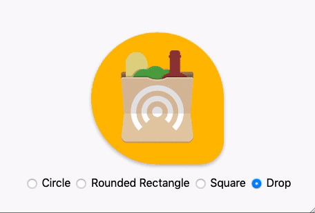

# Maskable.app

_Preview [maskable icons](https://www.w3.org/TR/appmanifest/#icon-masks) in the
browser._



---

Maskable icons allow web developers to specify a full-bleed icon that will be
cropped by the user-agent to match other icons on the device. On Android, this
lets developers get rid of the default white background around their icons and
use the entire provided space.

It's important to test maskable icons to ensure the important regions of the
icon are visible on any device and in any shape. Upload a maskable icon or drag
and drop it into [Maskable.app](https://maskable.app), then preview how it will
appear on different Android launchers.

## Developing

Install dependencies:

```shell
npm install
npm run prepare
```

Once the modules are installed, just run a web server. Thanks to
[@pika/web](https://github.com/pikapkg/web), no build step is needed to test the
program.

To generate the Service Worker, run `npm run sw`.

## Licensing

This project is available under the MIT License.
